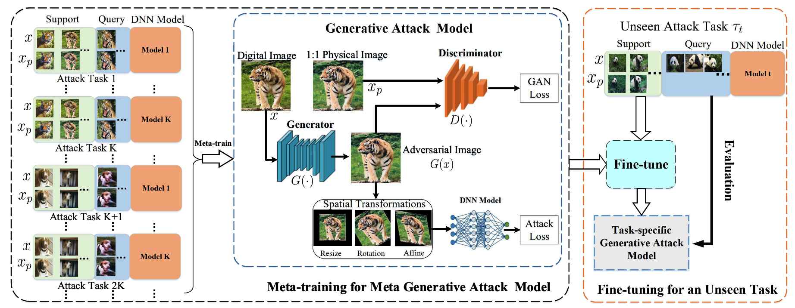

# Meta Physical Adversarial Attack with Improved Robustness and Generalization

*this paper is received by iccv 2021*

## Method


## Dataset and pretrained model download

1. download the pre-trained classifier on GTSRD from https://drive.google.com/drive/folders/1l4s6XLx9PVRSUl1ZXUguK8Wa_1pGXkBH?usp=sharing
2. collect digital and physical images dataset of GTSRD or ImageNet , put them in `image` folder like this:

```
image
	|
	|--label1
	|       |--TrainA(digital)
	|       |--TrainB(physical)
	|
	|--label2
	|       |--TrainA(digital)
	|       |--TrainB(physical)
	|--label3
	|       |--TrainA(digital)
	|       |--TrainB(physical)
	.
	.
	.
```


4. run `./run.sh` to train the GAN networks

5. run `./run_test.sh` to finetune the GAN on unseen images  and unseen classifiers

6. evaluate the generated adversarial images in checkpoints folder

